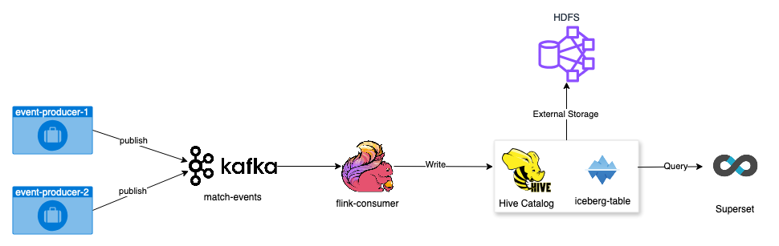

## Simple Streaming Ingestion

This pipeline processes Kafka messages using Flink and writes into Iceberg tables stored on HDFS.
The Iceberg tables are created within Hive Catalog which are available to query within Superset.



## football_match_event_producer
This python project generates random football match events and publishes to a Kafka Topic.
- Install packages: pip install -r requirements.txt
- Start Producer: `python football_match_event_producer/src/app.py --topic <topic-name> --bootstrap-servers <broker-server> --home '<TEAM_NAME>' --away '<TEAM_NAME>' --log-file <log-file-path>`

## flink-consumer 
This java project consumes football match events from Kafka Topic, applies aggregation logic to the events, creates and writes to the Iceberg tables.<br>
This job accepts a YAML configuration only , refer `src/main/resources/config-docker.yml`<br>
To Build jar, make sure you have Maven and Java 17:
- Run `cd flink-consumer`
- Build `mvn clean package`

Jar will be created in `simple-streaming-ingestion/libs/flink-consumer-x.x.jar`
The jar does not contain the required dependencies. It can be only deployed on a Flink cluster which has the required dependencies, see `docker/flink-consumer/jars`

## Docker
### Setup
- Python (football_match_event_producer x 2)
- Kafka (Zookeeper and Broker)
- Hadoop (Namenode + Datanode + YARN)
- Hive (Server + Postgres + metastore)
- Flink (JobManager + TaskManager)
- Superset (Redis + Postgres + Server)

#### Steps:
- Clone repository
- Run: `cd docker`
- Start services: `docker-compose up`

## Applications:

- HDFS: http://localhost:9870/
- YARN: http://localhost:8080
- Hive: http://localhost:10002/
- Flink: http://localhost:8081/
- Superset: http://localhost:8088/sqllab/

## Sample Query
```sql
select
	concat(home_team , ' vs ' , away_team) as match, 
	game_time as `time`,
	concat(get_json_object(home_team_stats,'$.GOAL')  , ' - ' , get_json_object(away_team_stats,'$.GOAL')) as score, 
	concat(get_json_object(home_team_stats,'$.POSSESSION')  , ' - ' , get_json_object(away_team_stats,'$.POSSESSION')) as possession,
	concat(get_json_object(home_team_stats,'$.SHOT')  , ' - ' , get_json_object(away_team_stats,'$.SHOT')) as shots, 
	concat(get_json_object(home_team_stats,'$.SHOT_ON_TARGET')  , ' - ' , get_json_object(away_team_stats,'$.SHOT_ON_TARGET')) as on_target, 
	concat(get_json_object(home_team_stats,'$.PASS_COMPLETE')  , ' - ' , get_json_object(away_team_stats,'$.PASS_COMPLETE')) as passes_completed, 
	concat(get_json_object(home_team_stats,'$.PASS_PERCENT')  , ' - ' , get_json_object(away_team_stats,'$.PASS_PERCENT')) as pass_success_rate,
	concat(get_json_object(home_team_stats,'$.CORNER')  , ' - ' , get_json_object(away_team_stats,'$.CORNER')) as corners,
	concat(get_json_object(home_team_stats,'$.FOUL_COMMIT')  , ' - ' , get_json_object(away_team_stats,'$.FOUL_COMMIT')) as fouls,
	concat(get_json_object(home_team_stats,'$.OFFSIDE')  , ' - ' , get_json_object(away_team_stats,'$.OFFSIDE')) as offsides,
	concat(get_json_object(home_team_stats,'$.YELLOW')  , ' - ' , get_json_object(away_team_stats,'$.YELLOW')) as yellow_cards,
	concat(get_json_object(home_team_stats,'$.RED')  , ' - ' , get_json_object(away_team_stats,'$.RED')) as red_cards
from ingestion.football_match_stats;
```
### Superset


## References

- Flink: https://flink.apache.org/
- Hive: https://hive.apache.org/
- Superset: https://superset.apache.org/docs/intro
